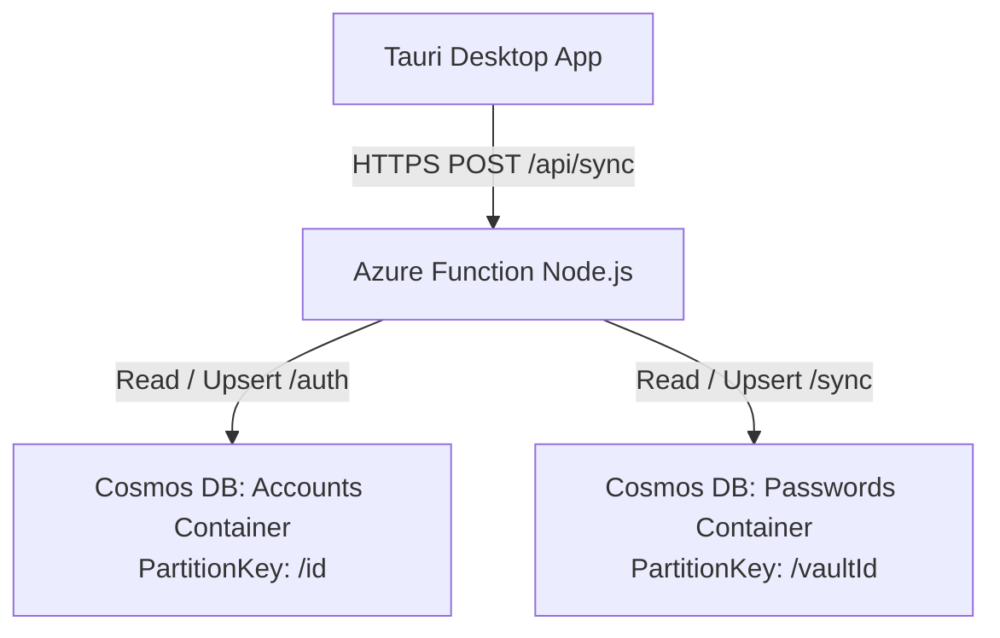

# Azure Cloud Sync Setup Guide (Cosmos DB & Functions)

This guide walks you through setting up an **Azure Cosmos DB (Serverless NoSQL)** backend with an **Azure Serverless Function** to synchronize your password vault across multiple devices.

---

## 1. Architecture Overview



- **Accounts Container**: Stores user profiles, authentication hashes, zero-knowledge encryption salts/keys, device registrations, and owned `vaultId` references (Partition Key: `/id`).
- **Passwords Container**: Stores encrypted password entries, custom fields, sync versions, and tombstones (`isDeleted`) partitioned by `vaultId` (Partition Key: `/vaultId`).

---

## 2. Step 1: Create Azure Cosmos DB (Serverless)

1. Log in to [Azure Portal](https://portal.azure.com/).
2. Click **Create a resource** $\rightarrow$ Search for **Azure Cosmos DB** $\rightarrow$ Click **Create**.
3. Select **Azure Cosmos DB for NoSQL**.
4. Configure the basics:
   - **Subscription & Resource Group**: Choose or create a resource group (e.g. `password-manager-rg`).
   - **Account Name**: e.g., `my-password-cosmosdb` (must be globally unique).
   - **Capacity mode**: Select **Serverless** *(zero fixed base cost; only pay per request)*.
5. Click **Review + create** $\rightarrow$ **Create**.

### Create Containers in Cosmos DB Data Explorer:
1. In your Cosmos DB account, go to **Data Explorer** $\rightarrow$ **New Container**:
   - **Database id**: Create new $\rightarrow$ `PasswordVaultDB`
   - **Container id**: `Accounts`
   - **Partition key**: `/id`
   - **Unique Keys** (Optional): `/email`
2. Click **New Container** again:
   - **Database id**: Use existing $\rightarrow$ `PasswordVaultDB`
   - **Container id**: `Passwords`
   - **Partition key**: `/vaultId`

*(Note: If you run the Azure Function, it will also automatically create `PasswordVaultDB`, `Accounts`, and `Passwords` containers if they do not exist yet!)*

---

## 3. Step 2: Create & Configure Azure Function App

1. In Azure Portal, click **Create a resource** $\rightarrow$ **Function App**.
2. Settings:
   - **Publish**: Code
   - **Runtime stack**: Node.js (20 LTS or 22 LTS)
   - **Operating System**: Linux
   - **Hosting Plan**: **Consumption (Serverless)**
3. Under **Storage**, select an Azure Storage Account.
4. Click **Review + create** $\rightarrow$ **Create**.

### Add Cosmos DB Connection String to Function App:
1. Go to your **Cosmos DB** resource $\rightarrow$ **Keys** $\rightarrow$ Copy the **PRIMARY CONNECTION STRING**.
2. Go to your **Function App** $\rightarrow$ **Settings** $\rightarrow$ **Environment variables** (or **Configuration**).
3. Click **+ Add** (App setting):
   - **Name**: `COSMOS_DB_CONNECTION_STRING`
   - **Value**: *(Paste your Cosmos DB Primary Connection String)*
4. Click **Apply** / **Save**.

---

## 4. Step 3: Deploy Azure Function Code

Deploy the contents of the `azure-functions` directory to your Function App using **VS Code Azure Functions Extension** or **Azure CLI**:

```bash
cd azure-functions
npm install
func azure functionapp publish <YOUR_FUNCTION_APP_NAME>
```

---

## 5. Step 4: Configure CORS in Azure

1. Open your Function App in the Azure Portal.
2. Under **API** in the left menu, select **CORS**.
3. Add the following allowed origins:
   - `http://localhost:1420`
   - `http://localhost:5173`
   - `tauri://localhost`
   - `https://tauri.localhost`
   - Or enter `*` for development/testing.
4. Check **Enable Access-Control-Allow-Credentials**.
5. Click **Save**.

---

## 6. Step 5: Connect Desktop App

1. In your Function App, go to **Functions** $\rightarrow$ **sync** $\rightarrow$ **Get Function Url**.
2. Launch your Password Manager desktop app.
3. Click the **Cloud Sync** button in the header bar.
4. Switch Provider to **Azure Serverless Function**.
5. Fill in:
   - **Azure Function URL**: `https://your-app-name.azurewebsites.net/api/sync`
   - **Azure Function Key**: `YOUR_AZURE_FUNCTION_KEY`
   - **Vault Identifier**: `my-vault` (or your user's vaultId)
6. Click **Save & Sync Now**.
